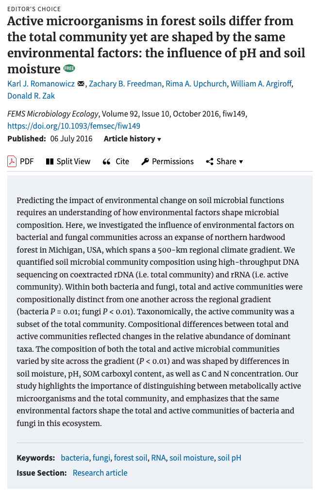

# Active microorganisms in forest soils differ from the total community yet are shaped by the same environmental factors: the influence of pH and soil moisture

#### Karl J. Romanowicz, Zachary B. Freedman, Rima A. Upchurch, William A. Argiroff, and Donald R. Zak

##### Published in ***FEMS Microbiology Ecology*** on July 6, 2016

##### Link to the article: [https://academic.oup.com/femsec/article/92/10/fiw149/2197794](https://academic.oup.com/femsec/article/92/10/fiw149/2197794)

***************

**Rendered Code:** [https://rpubs.com/kjromano/MI_Gradient_Romanowicz_2016](https://rpubs.com/kjromano/MI_Gradient_Romanowicz_2016)

**NCBI BioProject:** [PRJNA222775](http://www.ncbi.nlm.nih.gov/bioproject/PRJNA222775) for raw .fastq files

**SRA Accession Numbers:** [SRR1944476](http://trace.ncbi.nlm.nih.gov/Traces/sra/?run=SRR1944476) and [SRR1944477](http://trace.ncbi.nlm.nih.gov/Traces/sra/?run=SRR1944477).

**Direct any questions regarding this repository to lead author:** [Karl J. Romanowicz](mailto:kjromano@umich.edu).

***************

##### **Directories:**

1. **Data:** Includes final output files from **MOTHUR** necessary to run statistics in **R** as well as the environmental metadata `env.txt` necessary for PERMANOVA analyses.
	- **Bacteria:** all `.oligos` files for separating bacterial reads by plot
	- **Fungi:** all `.oligos` files for separating fungal reads by plot
	- **mothur.reference:** 16S and 28S reference database files used for alignment and taxonomy assignment purposes for bacteria and fungi.
	- **mothur.output:** final MOTHUR files created from pipeline and used in all downstream statistics. Provided here for reproducibility.
		- MOTHUR `cons.tax.summary` files
		- MOTHUR `groups.summary` files
		- MOTHUR `.shared` files

	*ZIP files need to be extracted and all resulting files placed directly in their* **corresponding directory folder** *for batch files to operate correctly.*

2. **MOTHUR_batch:** includes two batch files for processing raw PacBio sequencing data through a custom MOTHUR bioinformatic pipeline.
	- `bacteria.master.list.subsample.batch` Bacteria MOTHUR batch file
	- `fungi.master.list.subsample.batch` Fungi MOTHUR batch file

3. **MI-Gradient-Romanowicz-2016.Rmd:** RMarkdown dynamic document with rendered code for complete statistical reproducibility within the R environment.

**Note:** This project is under the General MIT Public License.
